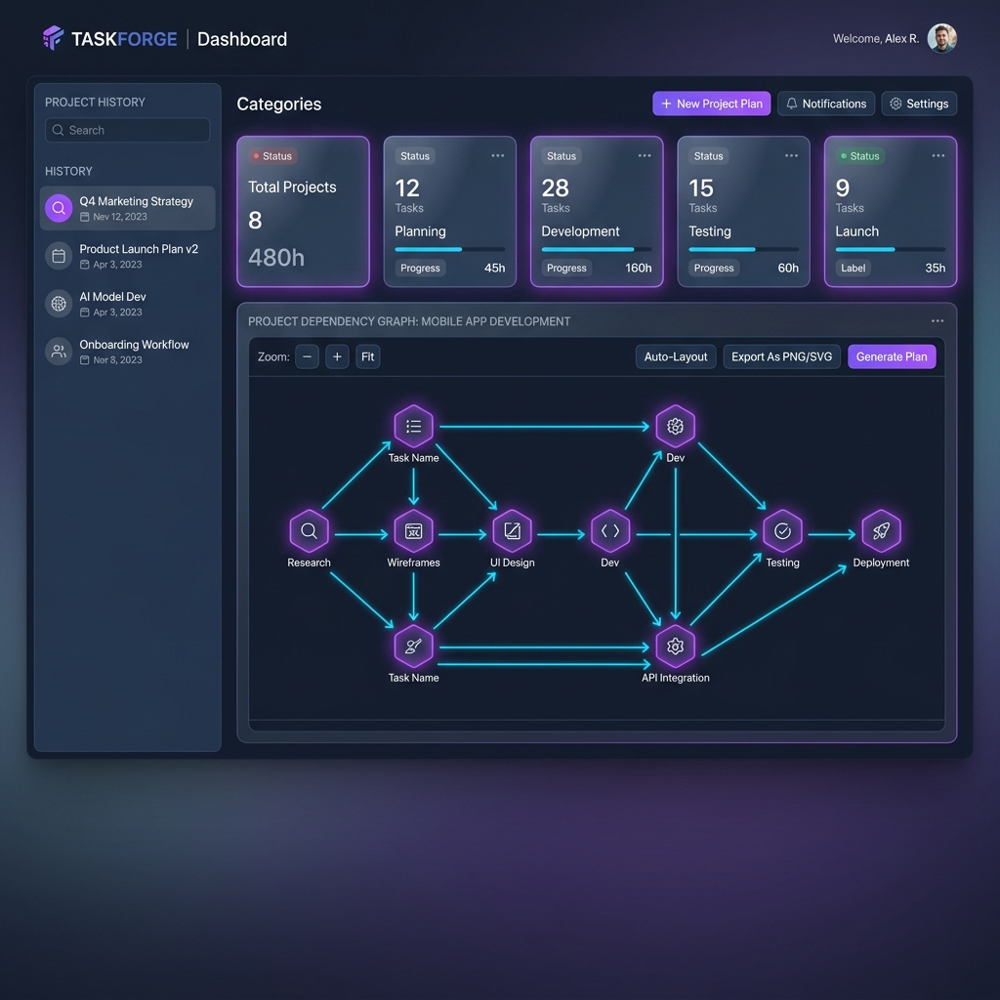

# TaskForge ⚒️

TaskForge is a production-grade, recursive AI task decomposition engine. It translates high-level project goals into structured, validated directed acyclic graph (DAG) project plans, featuring parallel model execution, resilient fallback mechanics, cost limits, and real-time streaming progress.

It operates in a hybrid mode, utilizing cloud-hosted OpenRouter models for architecture planning and PM refinement, and local Ollama models for specialist tasks, or can be run completely offline.

---

## Visual Dashboard



---

## Architecture & Workflow

TaskForge utilizes a Map-Reduce pipeline to decompose complex goals. The core flow is summarized below:

```
                  +--------------------------------+
                  |  Vue 3 / Tailwind Client App   |
                  +---------------+----------------+
                                  |
                   SSE / HTTP     |  (serves static_dist/)
                                  v
                  +---------------+----------------+
                  |  FastAPI Backend Controller    |
                  +---------------+----------------+
                                  |
                                  v
                  +---------------+----------------+
                  |    TaskForge Engine (Pipeline) |
                  +---------------+----------------+
                                  |
          +-----------------------+-----------------------+
          |                       |                       |
          v                       v                       v
 [Map: Architect]        [Reduce: Specialists]       [Refine: PM]
  Create Categories        Detail Tasks per Cat       Build & Validate DAG
```

1. **Map (Architect)**: Analyzes the goal and structures high-level categories.
2. **Reduce (Specialists)**: Concurrently generates granular task listings for each category.
3. **Refine (Project Manager)**: Calculates inter-task dependencies and validates the resulting DAG (cycle prevention & topological sorting).

---

## Key Features

- **Recursive Map-Reduce Decomposition**:
  - **Map (Architect)**: Analyzes goals and maps high-level categories.
  - **Reduce (Specialists)**: Concurrently generates granular task listings for each category.
  - **Refine (Project Manager)**: Calculates inter-task dependency relationships and validates the resulting DAG.
- **Strict Validation & Cycle Prevention**: Automatically prevents duplicate IDs, checks for missing dependencies, and runs topological sorting to detect and block cyclic dependencies.
- **Production Hardening (Phase 2.5)**:
  - **Free-Model Validator**: Pydantic settings validation blocks paid models on startup, preventing unintended cloud billing.
  - **Rate-Limit Resiliency**: Intercepts `HTTP 429` responses from OpenRouter, parses `Retry-After` headers, and automatically retries with backoff.
  - **Fallback Chain**: Gracefully degrades: Primary Model $\rightarrow$ `openrouter/free` router $\rightarrow$ local Ollama fallback.
  - **Per-Provider Concurrency**: Independent semaphores prevent queuing bottlenecks on local models while maximizing cloud throughput.
  - **Granular Quota-Safe Health Check**: The `/health` endpoint checks SQLite, Ollama, and OpenRouter (using `/auth/key` to bypass model quotas).
  - **Input & Cost Limits**: Caps input lengths to 2000 characters and generation costs to $0.01 per request.
  - **Real-Time Streaming Progress**: Streams Server-Sent Events (SSE) from the FastAPI backend to Streamlit for real-time specialist task generation progress.
  - **CI/CD & Secret Hooks**: Integrated pre-commit hooks block `.env` checkins or hardcoded secrets, and GitHub Actions verify tests automatically.

---

## Installation & Setup

### 1. Clone the Repository
```bash
git clone https://github.com/murali19980/TaskForge.git
cd TaskForge
```

### 2. Configure Virtual Environment
Initialize and activate a virtual environment:
```bash
python -m venv .venv
source .venv/bin/activate  # On Windows: .venv\Scripts\activate
```

### 3. Install Package & Dependencies
Install TaskForge in editable mode with development dependencies:
```bash
pip install -e ".[dev]"
```

### 4. Install Pre-Commit Hooks
Register the security and formatting hooks with git:
```bash
pre-commit install
```

### 5. Setup Environment Variables
Create a `.env` file based on `.env.example` (Note: `.env` is ignored by Git to protect your secrets):
```bash
cp .env.example .env
```
Open `.env` and fill in:
- `OPENROUTER_API_KEY`: Paste your OpenRouter API key (only free models are allowed, e.g. `google/gemini-2.5-flash:free`).
- `OLLAMA_HOST`: The endpoint of your local Ollama server (default: `http://localhost:11434`).
- `OLLAMA_MODEL`: Local model name (default: `qwen2.5-coder:3b`).

---

## Running the Application

TaskForge includes an automated runner script (`run.py`) which checks dependencies, builds the frontend Vue 3 application into `static_dist/`, and launches the FastAPI backend.

### 1. Start Local Ollama Models
Ensure Ollama is running and download the default model:
```bash
ollama serve
ollama pull qwen2.5-coder:3b
```

### 2. Run the Unified Application
Run the setup and startup script:
```bash
python run.py
```
This script will:
1. Audit and install Node/npm dependencies for the Vue client.
2. Compile and build the frontend assets into `static_dist/`.
3. Launch the FastAPI server on `http://localhost:8000`.
4. Automatically open your browser to the TaskForge Dashboard.

*Note: You can skip compiling the frontend if it's already built by running `python run.py --skip-build`.*

---

## Testing & Quality Control

### Running Tests
Execute the pytest suite (covers Pydantic models, API caches, provider fallbacks, streaming progress, and Streamlit AppTest rendering):
```bash
pytest -v
```

### Running Hooks Manually
To check all files against the formatting and security secrets hooks manually:
```bash
pre-commit run --all-files
```

---

## License

This project is licensed under the MIT License - see the [LICENSE](LICENSE) file for details.
